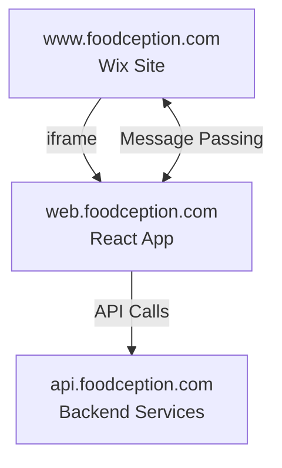

# System Integration Architecture

## Overview

Foodception consists of three main components working together:

1. **www.foodception.com** (Wix Platform)
   - Main website wrapper
   - Handles header/footer
   - Built-in store functionality
   - Comments section
   - Authentication system
   - SEO optimization

2. **web.foodception.com** (This React Project)
   - Core business logic
   - Main content area
   - API interactions
   - Embedded via iframe

3. **api.foodception.com**
   - Backend API services
   - Business logic implementation



## Deployment Architecture

### GitHub Pages Deployment

The React application is hosted on GitHub Pages:

1. **Deployment Process**:
   ```bash
   npm run deploy  # Runs gh-pages -d build
   ```

2. **CI/CD Pipeline**:
   - Automated deployments via GitHub Actions
   - Pipeline status: https://github.com/reyou/foodception-web-react/actions

3. **Environments**:
   - Production: https://web.foodception.com
   - Development: https://reyou.github.io/foodception-web-react

## Integration Architecture

### Iframe Integration

The React application is embedded in the Wix site via an iframe, enabling:
- Separation of concerns
- Independent deployment
- Modular development

```html
<!-- Example iframe integration -->
<iframe 
  src="https://web.foodception.com?iframeId=main-content" 
  id="main-content">
</iframe>
```

### Cross-Window Communication

Communication between Wix (parent) and React (child) is handled through the Window postMessage API:

1. **Initialization**:
```typescript
useEffect(() => {
  // Get iframeId from query params
  const params = new URLSearchParams(window.location.search);
  const iframeId = params.get('iframeId') || 'N/A';
  
  // Set up listeners
  WindowState.addResizeListener(iframeId);
  AuthUtils.addAuthListener();
  AuthUtils.runAuthStateListener();
  
  // Cleanup
  return () => {
    WindowState.removeResizeListener();
    AuthUtils.removeAuthListener();
    AuthUtils.removeAuthStateListener();
  };
}, []);
```

2. **Message Types**:
   - Authentication state changes
   - Window resize events
   - Navigation events
   - Content updates

3. **Utility Classes**:
   - `ParentWindowUtils`: Handles communication with parent window
   - `AuthUtils`: Manages authentication-related messages
   - `WindowState`: Manages window state and resize events

### Authentication Flow

1. **Initialization**:
   ```typescript
   AuthUtils.addAuthListener();
   AuthUtils.runAuthStateListener();
   ```

2. **Message Handling**:
   - Parent window sends auth state changes
   - React app updates its state accordingly
   - Protected routes are updated based on auth state

3. **Cleanup**:
   ```typescript
   AuthUtils.removeAuthListener();
   AuthUtils.removeAuthStateListener();
   ```

## Security Considerations

1. **Message Origin Validation**:
   ```typescript
   // Example origin validation
   if (event.origin !== expectedOrigin) {
     return;
   }
   ```

2. **Data Sanitization**:
   - All messages are validated before processing
   - Type checking for message payloads
   - Security headers for API calls

3. **Error Handling**:
   - Graceful fallbacks for communication failures
   - Error boundaries for component failures
   - Logging and monitoring

## Development Guidelines

1. **Message Passing**:
   - Use typed message interfaces
   - Implement error handling
   - Log important events

2. **Testing**:
   - Mock parent window communication
   - Test message handlers
   - Validate security measures

3. **Debugging**:
   - Use browser dev tools
   - Check console for message logs
   - Verify origin validation
