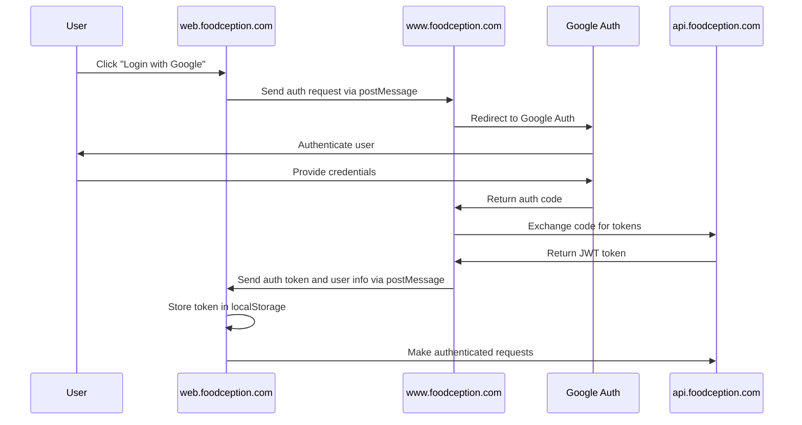

# Google Authentication Integration Guide

## Overview

This document provides guidelines for implementing Google Authentication in the Foodception web application. The authentication system is designed to work within the iframe architecture where the React application (web.foodception.com) is embedded in the Wix platform (www.foodception.com).

## Architecture

Foodception uses a delegated authentication model:

1. **Wix Platform (www.foodception.com)**
   - Handles the actual authentication process
   - Manages user sessions and tokens
   - Communicates auth state to the React app

2. **React Application (web.foodception.com)**
   - Initiates authentication request via postMessage to parent frame
   - Receives authentication state via postMessage
   - Stores JWT tokens locally
   - Uses tokens for API authorization
   - Updates UI based on authentication state



## Implementation Steps

### 1. Google Developer Console Setup

1. Go to [Google Developer Console](https://console.developers.google.com/)
2. Create a new project or select an existing one
3. Navigate to "Credentials" and create OAuth 2.0 Client ID
4. Configure the OAuth consent screen:
   - Add application name, logo, and contact information
   - Set authorized domains to include `foodception.com`
5. Create OAuth client ID:
   - Application type: Web application
   - Authorized JavaScript origins: 
     - `https://www.foodception.com`
     - `https://web.foodception.com` (for development)
   - Authorized redirect URIs:
     - `https://www.foodception.com/oauth-callback`
     - `https://web.foodception.com/oauth-callback` (for development)
6. Note your Client ID and Client Secret

### 2. Google Sign-In URL

When redirecting users to Google for authentication, use the following URL format:

```
https://accounts.google.com/o/oauth2/v2/auth?client_id=37680353518-d29v2ajmdgul2n5ho8deu6nsaguo3ja8.apps.googleusercontent.com&redirect_uri=http://localhost:3000/user/oauth-callback/google&response_type=code&scope=openid&access_type=offline&prompt=consent
```

Parameters explained:
- `client_id`: Your Google OAuth client ID (37680353518-d29v2ajmdgul2n5ho8deu6nsaguo3ja8.apps.googleusercontent.com)
- `redirect_uri`: Must match one of the authorized redirect URIs in your Google Console
- `response_type`: Use "code" for server-side flow (recommended)
- `scope`: Space-separated list of requested permissions
- `access_type`: Set to "offline" if you need a refresh token
- `prompt`: Set to "consent" to always show the consent screen

### 3. Handling the Authorization Code

After the user authenticates with Google, they will be redirected back to your specified redirect URI with an authorization code. The URL will look like:

```
http://localhost:3000/user/oauth-callback/google?code=4%2F0AQSTgQGed3G7YF-z_k10-Y5C8FO75aHTG9H-vi5W8rDeKjNRKhpHk1SJUaVN2zdW0olwWQ&scope=openid&authuser=0&prompt=consent
```

#### 3.1 Exchange the Code for Tokens

The next step is to exchange this authorization code for access and ID tokens. This should be done server-side to protect your client secret:

#### Understanding Access and ID Tokens

When exchanging the authorization code, Google will return several types of tokens, each serving a different purpose:

1. **Access Token**
   - A credential used to access Google APIs
   - Short-lived (typically 1 hour)
   - Used in HTTP requests with the Authorization header: `Authorization: Bearer [access_token]`
   - Allows your application to make API calls on behalf of the user
   - Contains no user information, just an opaque string

2. **ID Token**
   - A JWT (JSON Web Token) containing user identity information
   - Signed by Google to ensure authenticity
   - Contains claims about the user (email, name, profile picture, etc.)
   - Used to verify the user's identity
   - Can be decoded and verified using Google's public keys
   - Structure: header.payload.signature

3. **Refresh Token** (when `access_type=offline`)
   - Long-lived token used to obtain new access tokens
   - Sent only on the first authorization or when `prompt=consent`
   - Should be securely stored server-side
   - Used when access tokens expire

```javascript
// Server-side code (Node.js example)
async function exchangeCodeForTokens(code) {
  const tokenEndpoint = 'https://oauth2.googleapis.com/token';
  
  const params = new URLSearchParams();
  params.append('code', code);
  params.append('client_id', '37680353518-d29v2ajmdgul2n5ho8deu6nsaguo3ja8.apps.googleusercontent.com');
  params.append('client_secret', 'YOUR_CLIENT_SECRET'); // Keep this secure on the server
  params.append('redirect_uri', 'https://www.foodception.com/oauth-callback');
  params.append('grant_type', 'authorization_code');
  
  try {
    const response = await fetch(tokenEndpoint, {
      method: 'POST',
      headers: {
        'Content-Type': 'application/x-www-form-urlencoded',
      },
      body: params
    });
    
    const data = await response.json();
    
    // The response will contain:
    // - access_token: Short-lived token to access Google APIs
    // - id_token: Contains user information
    // - refresh_token: Long-lived token to get new access tokens (if access_type=offline)
    // - expires_in: Token expiration time in seconds
    
    return data;
  } catch (error) {
    console.error('Error exchanging code for tokens:', error);
    throw error;
  }
}
```

#### 3.2 Verify and Decode the ID Token

The ID token is a JWT that contains user information. You should verify this token before trusting its contents:

```javascript
// Server-side code (Node.js example with Google Auth Library)
const {OAuth2Client} = require('google-auth-library');
const client = new OAuth2Client('37680353518-d29v2ajmdgul2n5ho8deu6nsaguo3ja8.apps.googleusercontent.com');

async function verifyIdToken(idToken) {
  try {
    const ticket = await client.verifyIdToken({
      idToken,
      audience: '37680353518-d29v2ajmdgul2n5ho8deu6nsaguo3ja8.apps.googleusercontent.com',
    });
    
    const payload = ticket.getPayload();
    // payload contains user information:
    // - sub: Unique Google user ID
    // - email: User's email
    // - name: User's full name
    // - picture: URL to user's profile picture
    // - etc.
    
    return payload;
  } catch (error) {
    console.error('Error verifying ID token:', error);
    throw error;
  }
}
```

#### 3.3 Create a Session or JWT for Your Application

After verifying the user's identity, create a session or JWT for your application:

```javascript
// Server-side code (Node.js example with jsonwebtoken)
const jwt = require('jsonwebtoken');

function createAppToken(googleUserInfo) {
  // Create a custom token for your application
  const token = jwt.sign(
    {
      userId: googleUserInfo.sub,
      email: googleUserInfo.email,
      name: googleUserInfo.name,
      // Add any other claims you need
    },
    process.env.JWT_SECRET, // Your application's secret key
    { expiresIn: '1h' } // Token expiration
  );
  
  return token;
}
```

#### 3.4 Send the Token to the Client

Finally, send the token to the client (React app):

```javascript
// Server-side route handler (Express.js example)
app.get('/user/oauth-callback/google', async (req, res) => {
  try {
    const { code } = req.query;
    
    // Exchange code for tokens
    const tokens = await exchangeCodeForTokens(code);
    
    // Verify and decode the ID token
    const googleUserInfo = await verifyIdToken(tokens.id_token);
    
    // Create a token for your application
    const appToken = createAppToken(googleUserInfo);
    
    // Option 1: Redirect to the React app with the token in the URL
    // (Not recommended for production due to security concerns)
    res.redirect(`http://localhost:3000?token=${appToken}`);
    
    // Option 2: Set the token in a secure, HTTP-only cookie
    // (Better for production)
    res.cookie('auth_token', appToken, {
      httpOnly: true,
      secure: process.env.NODE_ENV === 'production',
      sameSite: 'strict',
      maxAge: 3600000 // 1 hour
    });
    
    // Redirect to the React app
    res.redirect('http://localhost:3000');
  } catch (error) {
    console.error('Authentication error:', error);
    res.redirect('http://localhost:3000/login?error=authentication_failed');
  }
});
```

### 4. Wix Platform Configuration

1. In Wix Developer Tools, navigate to the site's dashboard
2. Go to "Settings" > "OAuth Applications"
3. Add Google as an OAuth provider
4. Enter the Client ID and Client Secret from Google Developer Console
5. Configure the callback URL to match the one set in Google Console
6. Set up the required scopes:
   - `profile`
   - `email`
   - Any additional scopes needed for your application

### 5. React Application Integration

#### Initiating Google Authentication

1. Create a function to initiate Google authentication from the React app:

```typescript
// Add to a login component or service
function initiateGoogleLogin() {
  // Send message to parent window (Wix) to start Google auth flow
  window.parent.postMessage(
    {
      type: 'auth',
      action: 'initiateGoogleAuth',
      source: 'react-app'
    },
    process.env.REACT_APP_WIX_URL || ''
  );
}
```

2. Add a Google login button to your UI:

```tsx
<button 
  className="google-login-btn" 
  onClick={initiateGoogleLogin}
>
  <i className="bi bi-google"></i> Login with Google
</button>
```

#### Handling Authentication Response

1. Update the `AuthUtils.ts` file to handle Google authentication messages:

```typescript
// Add to existing AuthUtils.ts
static handleGoogleAuthMessage(payload: any) {
  if (payload.authToken) {
    localStorage.setItem('authToken', payload.authToken);
    
    // Store user profile information
    if (payload.userProfile) {
      localStorage.setItem('userProfile', JSON.stringify(payload.userProfile));
    }
    
    // Publish login success event
    EventBus.publish(EventTypes.LOGIN_SUCCESS, payload);
  }
}
```

2. Update the message listener to handle Google auth events:

```typescript
// Update existing authMessageListener method
static authMessageListener(event: MessageEvent) {
  // Validate origin
  const allowedOrigin = process.env.REACT_APP_WIX_URL;
  if (event.origin !== allowedOrigin) {
    return;
  }

  const { type, action, payload } = event.data;

  // Process auth-related messages
  if (type === 'auth') {
    if (action === 'setAuthToken') {
      if (payload.authToken) {
        localStorage.setItem('authToken', payload.authToken);
      }
      else {
        localStorage.removeItem('authToken');
      }
    }
    else if (action === 'googleAuth') {
      AuthUtils.handleGoogleAuthMessage(payload);
    }
  }
  // ... rest of the existing code
}
```

### 6. Wix Platform Implementation

1. Add event listener in Wix to handle authentication requests from the React app:

```javascript
// In Wix code
window.addEventListener('message', (event) => {
  // Validate origin
  if (event.origin !== 'https://web.foodception.com') {
    return;
  }
  
  const { type, action, source } = event.data;
  
  if (type === 'auth' && action === 'initiateGoogleAuth' && source === 'react-app') {
    // Initiate Google OAuth flow by redirecting to Google's authorization URL
    const authUrl = 'https://accounts.google.com/o/oauth2/v2/auth?' +
      'client_id=37680353518-d29v2ajmdgul2n5ho8deu6nsaguo3ja8.apps.googleusercontent.com' +
      '&redirect_uri=' + encodeURIComponent('https://www.foodception.com/oauth-callback') +
      '&response_type=code' +
      '&scope=' + encodeURIComponent('openid email profile') +
      '&access_type=offline' +
      '&prompt=consent';
    
    window.location.href = authUrl;
  }
});
```

2. After Google redirects back to Wix, send the authentication result to the React app:

```javascript
// In Wix code, after receiving OAuth callback
function handleGoogleAuthCallback(authResult) {
  // Get the iframe element
  const iframe = document.getElementById('foodception-app');
  
  // Send auth result to React app
  iframe.contentWindow.postMessage({
    type: 'auth',
    action: 'googleAuth',
    payload: {
      authToken: authResult.token,
      userProfile: {
        id: authResult.userId,
        name: authResult.name,
        email: authResult.email,
        picture: authResult.picture
      }
    }
  }, 'https://web.foodception.com');
}
```

### 7. API Integration

1. Ensure your backend API validates Google-issued JWT tokens
2. Implement token verification using Google's public keys
3. Extract user information from the verified token
4. Associate Google accounts with your application's user accounts

### 8. Testing the Integration

1. **Development Environment**:
   - Use the Google OAuth Playground to test token generation
   - Implement a mock parent window for local testing
   - Verify token validation with your backend

2. **Production Testing**:
   - Test the complete flow in the production environment
   - Verify proper token handling and expiration
   - Test error scenarios and recovery

## Security Considerations

1. **Token Validation**:
   - Always validate tokens on the server side
   - Check token expiration before use
   - Verify the token's audience matches your application

2. **Origin Validation**:
   - Always validate message origins
   - Only accept messages from trusted domains

3. **Token Storage**:
   - Store tokens in localStorage (acceptable for SPA applications)
   - Consider implementing token refresh mechanisms
   - Clear tokens on logout or session expiration

4. **Scope Limitations**:
   - Request only the minimum required scopes
   - Document clearly what user data is being accessed

## Troubleshooting

### Common Issues

1. **"Origin not allowed" errors**:
   - Verify that all domains are properly configured in Google Console
   - Check that the message origin validation is using the correct URL

2. **Token validation failures**:
   - Ensure the token is being properly passed between windows
   - Verify that the token format is correct
   - Check for clock skew between client and server

3. **User not recognized after authentication**:
   - Verify that user profile information is being properly extracted
   - Check that the user account is being properly associated in your database

4. **Authentication flow interruption**:
   - Ensure the postMessage events are being properly sent and received
   - Check browser console for any errors in the communication
   - Verify that the iframe has the correct permissions to communicate with the parent

5. **Redirect URI mismatch**:
   - Ensure the redirect_uri parameter exactly matches one of the authorized redirect URIs in your Google Console
   - Check for any URL encoding issues in the redirect_uri parameter

6. **Invalid authorization code**:
   - Authorization codes can only be used once
   - Codes expire quickly (usually within minutes)
   - Ensure you're exchanging the code for tokens promptly

## References

- [Google OAuth 2.0 Documentation](https://developers.google.com/identity/protocols/oauth2)
- [Google Sign-In for Web](https://developers.google.com/identity/sign-in/web/sign-in)
- [Wix Authentication Documentation](https://dev.wix.com/docs/authentication)
- [JWT.io](https://jwt.io/) - For debugging JWT tokens
- [Window.postMessage API](https://developer.mozilla.org/en-US/docs/Web/API/Window/postMessage)